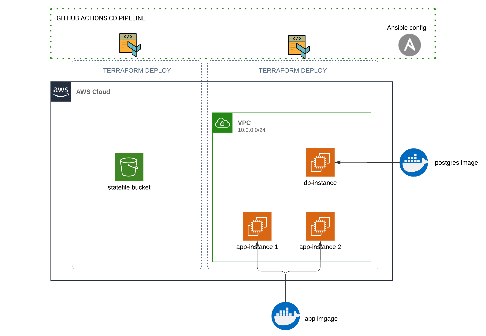
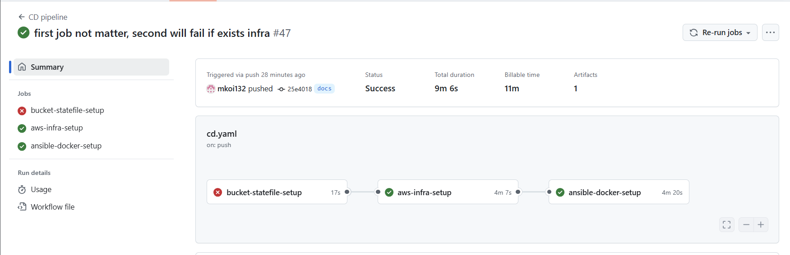
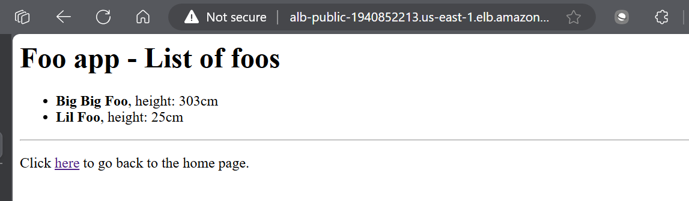

# 

## Solution design

This pipeline automates the deployment process, ensuring infrastructure is set up with Terraform, and containers are managed by Ansible.


**Checkout**
- [**TERRAFORM APP INFRASTRUCTURE CONFIGS**](./tf/)
- [**ANSIBLE CONFIGS**](./ansible/)

### Prerequisites

In order for the pipeline to run successfully, here are things to check for:

- [x] Valid working AWS credentials saved in Github Actions secrets. We will need
  - AWS_ACCESS_KEY_ID
  - AWS_SECRET_ACCESS_KEY
  - AWS_SESSION_TOKEN
- [x] Pre-generated SSH keypair saved in Github Actions secrets. We will need
  - SSH_KEY
  - SSH_KEY_PUB
    *Note: if the name of any credential ever change, promtly update it in the `.github/workflows/cd.yaml`*
- [x] Terraform configurations complete and located under [`./tf`▸](./tf/).
- [x] Ansible configuration accordingly to the infrastructure located at [`./ansible`▸](./ansible/).
- [x] [Pre-built application pushed to dockerhub.](./misc/how-to-build-app-docker-image.txt)

### The GitHub Actions pipeline

_This CD workflow will be triggered on two events: any push to main branch and manual trigger (`workflow_dispatch`) by calling Github Action API endpoint or [Github actions interface](https://docs.github.com/en/actions/managing-workflow-runs-and-deployments/managing-workflow-runs/manually-running-a-workflow)_
The pipeline does 3 jobs:
- [Spin up and configure s3 bucket to store remote statefile](#s3-statefile-bucket-setup)
- [Spin up the cloud infrastructure using Terraform](#aws-infrastructure-setup)
- [Set up deployed infrastructure with Ansible playbook configurations](#ansible-docker-setup)

#### s3 statefile bucket setup

_Overview: this job [build an s3 bucket](./misc/state-bucket-infra.tf) that is then use to store terraform statefile of the main infrastructure.This could be done manually as a Prerequisite of the pipline, but we try to maximize the automate_

This job could only be success at the first run with `s3.tfstate` being uploaded as artifact. It will fail if we re run it (infrastructure exists).
But it does not matter, we already got the infrastructure we need. So the next Job could eligibly be run even if this fails.

**IMPORTANT: If it fails on the fresh first run, check runner log**
**IMPORTANT 2: the uploaded artifact with `s3.tfstate` will help manually manage the s3 bucket. Overwite local `/misc/terraform.tfstate` with the content of this. Terraform will track the infrastructure exists in the `.tfstate`**

Example of pipeline continual with the bucket exists from previous run


#### AWS Infrastructure Setup

**Requirements:** This job could only be run after the [first job](#s3-statefile-bucket-setup) finished its run, _regardless_ the final status.
_Overview: For this job, the workflow load terraform configurations into an ubuntu instance, then use terraform cli commands to spin up our declared infrastructures_

**Steps:**

- **Checkout code**: Load in the repository code
- **Configure AWS credentials**: Load in stored GitHub Actions secrets AWS credentials using aws-actions.
- **Terraform Init**: Initializes Terraform in the cloned directory so it can read files the Terraform way
- **Add SSH key**: Load in the public and private SSH key from GitHub Actions secrets into specific repositories in the runner, so they can be used later.
- **Plan to Check for Changes**: Runs `terraform plan` to check for changes and outputs a plan file (`tfplan`).
- **Terraform Apply**: Applies the Terraform plan to spin up the AWS infrastructures
- **Upload alb dns**: Uploads the generated Application load ballance dns address as an artifact to access later.

**IMPORTANT: This job does nothing if infrastructure is already exists. The pipeline job will still pass but no change will be made to the existing infrastructure**
**IMPORTANT 2: Successfully run of this job will upload an artifact that contain the link to the public dns address of the application. However, the application is not accessible until the [ansible job](#ansible-docker-setup) success**

#### Ansible Docker Setup

**Requirement**: This job relies on [`aws-infra-setup`](#aws-infrastructure-setup). It will fail if no infrastructure is deployed.
_Overview: This job runner will mainly be working under the `./ansible/` directory, however, to generate an inventory list to work on, it will have to get infrastructure ip address from ./tf_

**Steps:**

- **Checkout code**: Load in the repository code.
- **Add SSH key**: Load in SSH keys from Github Action secrets
- **Configure AWS credentials**: Configures AWS credentials from Github Action secrets
- **Init Terraform and Generate Ansible Inventory**:
  - Runs `terraform init` to provide output back from statefile on s3 (no changes in infrastructure should be present)
  - Using the shell script `generate_inventory_jq.sh`, generate and map the outputs in Ansible format for `inventory.ini`. This file is placed under `../ansible/`.
- **Verify Ansible Inventory**: Verifies that the Ansible inventory file is correctly generated.
- **Install Ansible and Python3**: Installs Ansible and its dependencies, plus the `community.docker` collection to pull Docker containers using playbook.
- **Check if Containers are Running**: Checks if application and database containers (`foo_app` and `foo_db`) are already running (they're not)
- **Install Required Services**: If the containers are not running, it installs required services using an Ansible playbook (`install_docker_db_sql.yml`). (now should run)
- **Wait for Services to Start**: cooldown time

**IMPORTANT: This job does nothing if infrastructure is already exists. The pipeline job will pass but no change will be made to the existing infrastructure**

### Validating that the app is working

From the uploaded artifacts of a **successfull** pipeline, find the one with name `alb_dns`.
This artifact contains a plain text DNS address to the application loadballancer. We should be able to access the app through this link.


### Backup process: deploying from a shell script

#### Full infrastructure deployment

To prevent vendor lock-in operation, this pipeline can be move off github action workflow runner, and could independently be executed on any linux system, provided the whole directory exists with it.

**To trigger the deployment, change working directory to the project directory, then execute:**

```bash
chmod +x deploy.sh
bash deploy.sh
```

**IMPORTANT:** For the script to be executed success fully, please ensure all the [Prerequisites](#prerequisites) are met, AND the required files *MUST* be placed in those location:
- For AWS credentials: placed at `~/.aws/config` and `~/.aws/cedentials` see [Terraform guide](https://registry.terraform.io/providers/hashicorp/aws/latest/docs#authentication-and-configuration)
- For SSH key-pair: placed at `~/.ssh/`
  + Private pair of ssh key **must** be named `github_sdo_key`, see [Ansible config](./ansible/) for [limitation](./ansible/README.md#prerequisites)
  + Public pair of ssh key could be stored anywhere, but the file path **must** be accessible **and** be specified at [tf/terraform.tfvars path_to_public_key = ""](./tf/terraform.tfvars).
**IMPORTANT 2:** Since we move off github actions, no artifact will be uploaded. Please have a look through the script comments to find out generated file for `alb_dns`. statefile of s3 bucket will be generated under `misc/` directory

#### **[OPTIONAL:]** single instance deployment.

For testing and developing purposes, it is possible to deploy a less effort, simpler setup, yet functional with docker compose.

**The one-time-run script `my_deploy.sh ` will output a DNS address to the application.**

This script will deploy both application and database on a single EC2 instance, then configure them using ansible with a pre-set docker compose configuration. Finally, it generate an cccessible DNS access to the application.
