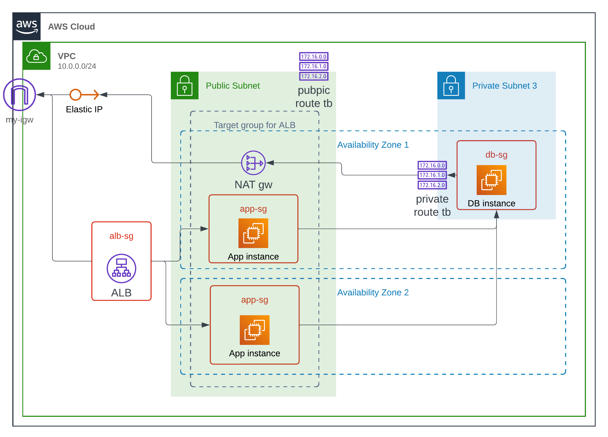

# Terraform Configuration Overview
*This contains Terraform configuration files and modules, which describe the desired the infrastructure we need. Also, a shell script that generate nessesary ansible inventory file `../ansible/inventory.ini` with up-to-date outputs of infrastructure that Terraform created and managed.*

*For more of how these created infrastructure will be used, [see Pipeline](../)*

## What would the infrastructure look like?

This diagram showcase the whole AWS infrastructure that is going to be created by Terraform running in this directory. As ip/dns addresses are managed by terraform, they could be accessible through TF output.

## Modules
Terraform modules promote reusability and consistency of infrastructure components, making deployments easier to manage and maintain. This setup describe 3 modules, represent the key components from the earlier diagram, which are: EC2 (**app_infra**), ALB (**load_ballancer**), and VPC (**subnets**)

### app_infra
This defines EC2 instances, 2 for application running and 1 for database, also security groups with approriate rules associated with each.
### load_ballancer
This defines a basic components for an AWS Application Load Ballancer (ALB), including target group with attached instances, Security group with approriate rules, and the load ballancer itself.
### subnets
- This defines basic network settings for the infrastructured described in the aboved diagram, including 2 public subnets and a private subnets in 2 different AZs to ensure resilience, availability and security best practise.
- This also scripts on other relevant network infrastructures, such as routing table, NAT gateway, elastic IP, which is to ensure we have an accessible, yet secured overall infrastructure that we need.

## Network flow and access points
- Application could be accessible through [the ABL](#load_ballancer), which Terraform will output a public DNS address to it after it bring up the infrastructure.
- Database instance allowing traffics comming from the app instances sg, which routed using internal route table
- App instances could access the database on Postgres port, also uses internal routing.
- Elasting IP and NAT gateway ensure database is reachable from the specified IP for maintenance purposes.
- Bastion host (ansible ssh port forwarding):
    + Since database is in a private subnet (not reacahble from outside network), we used SSH forwarding that allow SSH traffic to *'"jump"* to this instance from any of the public host that sitting in the same VPC.
    + This could be any instance in the PVC that Ansible could reach. However, we chose the first instance as bastion (so that traffict route within the same AZ-cheaper operation)

## Main Terraform configs.
This simply assemble up all the modules into an overall infrastructure, that could be provisioned and generate outputs that we need.

**IMPORTANT:** we configuer backend of this terraform structure (statefile) to be stored in a shared S3 bucket, which provide with ease of management from different end devices. Hence this statebucket is **REQUIRED BEFORE HAND** and should provide **sufficient permission to the role/user/credentials that the Terraform operate up on**

**IMPORTANT 2:** To maintain **sufficient permission** to any instance via SSH, A pair of ssh access key is **REQUIRED BEFORE HAND**. Pass on the `path_to_public_key` value before applying the infrastructure.
See *[Ansible](../ansible/)* for how the private pair of the keypair will be used.